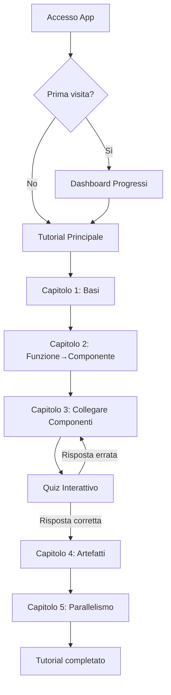

## 1. Product Overview
Tutorial interattivo React per insegnare la creazione di pipeline ML su Kubeflow usando KFP SDK v2. L'app guida gli sviluppatori attraverso concetti chiave come DAG, componenti, artefatti e controllo di flusso avanzato.

Obiettivo principale: Fornire un'esperienza di apprendimento hands-on con esempi pratici, quiz interattivi e codice eseguibile per padroneggiare Kubeflow Pipelines.

Target: Team di sviluppatori e data scientist che vogliono imparare a costruire pipeline ML production-ready su Kubernetes.

## 2. Core Features

### 2.1 User Roles
| Role | Registration Method | Core Permissions |
|------|---------------------|------------------|
| Learner | No registration required | Accesso completo a tutti i tutorial, progress tracking locale |

### 2.2 Feature Module
L'applicazione tutorial consiste nelle seguenti pagine principali:
1. **Tutorial principale**: Layout con sidebar di navigazione, barra di progresso, contenuto step-by-step interattivo
2. **Dashboard progressi**: Panoramica del progresso di apprendimento con statistiche di completamento

### 2.3 Page Details
| Page Name | Module Name | Feature description |
|-----------|-------------|---------------------|
| Tutorial principale | Sidebar di navigazione | Mostra elenco capitoli con indicatori di completamento, permette navigazione rapida tra i livelli |
| Tutorial principale | Barra di progresso | Visualizza progresso percentuale dell'utente, si aggiorna automaticamente avanzando nei capitoli |
| Tutorial principale | Area contenuto principale | Display dinamico dei contenuti tutorial con transizioni fluide tra i capitoli |
| Tutorial principale | Visualizzatore codice | Mostra snippet Python con syntax highlighting, include bottone copia negli appunti |
| Tutorial principale | Quiz interattivo | Domande a risposta multipla con validazione in tempo reale, blocca avanzamento se risposta errata |
| Tutorial principale | Split screen comparison | Vista affiancata per confrontare codice prima/dopo nella trasformazione funzione→componente |
| Tutorial principale | Placeholder media | Div grigio con testo per immagini da inserire (diagrammi DAG, schemi artefatti) |
| Dashboard progressi | Statistiche apprendimento | Mostra tempo trascorso, capitoli completati, quiz superati |

## 3. Core Process
**User Flow principale:**
L'utente inizia dal Tutorial principale dove può navigare liberamente tra i capitoli usando la sidebar. Ogni capitolo deve essere completato in ordine sequenziale, con i quiz che bloccano l'avanzamento fino a risposta corretta. La barra di progresso fornisce feedback visivo costante sullo stato di apprendimento.

**Flusso di navigazione:**
1. Accesso al tutorial → Dashboard progressi oppure Tutorial principale
2. Navigazione capitoli tramite sidebar
3. Lettura contenuti teorici con visualizzazione codice
4. Completamento quiz prima di procedere al capitolo successivo
5. Tracciamento automatico del progresso

## 4. User Interface Design

### 4.1 Design Style
- **Modalità**: Dark mode predefinito con accenti colori primari (blu elettrico #3B82F6)
- **Colori principali**: Sfondo #0F172A, testo primario #E2E8F0, testo secondario #94A3B8
- **Colori accent**: Blu primario #3B82F6, verde successo #10B981, rosso errore #EF4444
- **Tipografia**: Font system-ui, Inter o simile, dimensioni: titoli 24-32px, corpo 14-16px
- **Layout**: Sidebar fissa 280px, contenuto principale responsive, card-based design con ombreggiature sottili
- **Stile bottoni**: Rounded-lg (8px radius), hover effects con transizioni fluide, stati di focus visibili
- **Icone**: Lucide React per consistenza, dimensioni 16-24px
- **Effetti**: Transparenza alpha 0.9-0.95 per elementi sovrapposti, blur leggero su modali

### 4.2 Page Design Overview
| Page Name | Module Name | UI Elements |
|-----------|-------------|-------------|
| Tutorial principale | Sidebar navigazione | Background #1E293B, width 280px, items con padding 12px, indicatori di stato colorati, scrollbar custom |
| Tutorial principale | Barra progresso | Full-width in top, altezza 4px, background #334155, fill color #3B82F6 con animazione smooth |
| Tutorial principale | Area contenuto | Padding 32px, max-width 1200px, card background #1E293B con border #334155, border-radius 8px |
| Tutorial principale | Code blocks | Monaco Editor o Prism.js, tema dark, font-family 'Fira Code', font-size 14px, line-height 1.5 |
| Tutorial principale | Split screen | Grid 1fr 1fr con gap 24px, separatori verticali #334155, headers con titoli in grassetto |
| Tutorial principale | Quiz cards | Background #1E293B, border #475569, hover state #334155, radio buttons custom stilizzati |
| Dashboard progressi | Metric cards | Grid responsive, card min-height 120px, icona 32px colorata, testo metriche in grassetto |

### 4.3 Responsiveness
- Desktop-first approach con breakpoint principale a 1024px
- Sidebar collassa in hamburger menu su mobile (<768px)
- Contenuto principale diventa single-column su schermi stretti
- Font scaling responsive: body text scala da 14px (mobile) a 16px (desktop)
- Touch-optimized: target area minimo 44px per elementi interattivi

### 4.4 Effetti di Transizione
- Transizioni di pagina: fade-in 300ms ease-out
- Hover effects: scale(1.02) con durata 200ms
- Sticky elements: sidebar e progress bar con position sticky
- Scroll behavior: smooth scrolling tra le sezioni
- Loading states: skeleton screens per contenuti dinamici