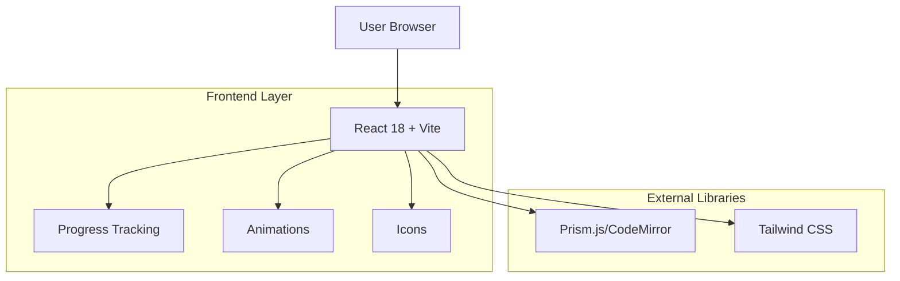

## 1. Architecture design



## 2. Technology Description
- Frontend: React@18 + tailwindcss@3 + vite
- Initialization Tool: vite-init
- Backend: None (applicazione client-side pura)
- Gestione stato: React Context + useState/useEffect hooks locali
- Storage: LocalStorage per tracciamento progresso utente
- Animazioni: Framer Motion (opzionale ma raccomandato per transizioni fluide)
- Syntax highlighting: Prism.js o CodeMirror per code blocks
- Icone: Lucide React per consistenza visiva

## 3. Route definitions
| Route | Purpose |
|-------|---------|
| / | Homepage del tutorial, redirect a /tutorial/basics |
| /tutorial/basics | Capitolo 1: Concetti di base su DAG e pipeline |
| /tutorial/components | Capitolo 2: Trasformazione funzione→componente |
| /tutorial/connecting | Capitolo 3: Collegare componenti con @dsl.pipeline |
| /tutorial/artifacts | Capitolo 4: Passaggio di artefatti tra componenti |
| /tutorial/parallelism | Capitolo 5: Esecuzione parallela e condizioni |
| /progress | Dashboard visualizzazione progressi utente |

## 4. Component Architecture

### 4.1 Core Components Structure
```typescript
// Main layout components
interface TutorialLayoutProps {
  children: React.ReactNode;
  currentChapter: string;
  progress: number;
}

interface SidebarProps {
  chapters: Chapter[];
  currentChapter: string;
  onChapterSelect: (chapterId: string) => void;
  completedChapters: string[];
}

interface ProgressBarProps {
  progress: number; // 0-100
  showPercentage?: boolean;
}

interface CodeBlockProps {
  code: string;
  language: 'python' | 'yaml';
  showCopyButton?: boolean;
  filename?: string;
}

interface QuizProps {
  question: string;
  options: string[];
  correctAnswer: number;
  onCorrectAnswer: () => void;
  onWrongAnswer: () => void;
}

interface SplitScreenProps {
  leftTitle: string;
  rightTitle: string;
  leftContent: React.ReactNode;
  rightContent: React.ReactNode;
}
```

### 4.2 State Management Types
```typescript
interface TutorialState {
  currentChapter: string;
  completedChapters: string[];
  quizResults: Record<string, boolean>;
  startTime: number;
  totalTime: number;
}

interface Chapter {
  id: string;
  title: string;
  description: string;
  order: number;
  hasQuiz: boolean;
  estimatedTime: number; // in minutes
}

interface CodeExample {
  title: string;
  description: string;
  code: string;
  language: 'python';
  highlights?: number[]; // line numbers to highlight
}
```

## 5. Data Model (Local Storage)

### 5.1 Local Storage Schema
```typescript
interface UserProgress {
  userId: string; // generato automaticamente al primo accesso
  tutorialProgress: {
    completedChapters: string[];
    quizResults: Record<string, boolean>;
    lastAccessedChapter: string;
    totalTimeSpent: number; // milliseconds
  };
  preferences: {
    theme: 'dark' | 'light';
    codeFontSize: number;
    autoSave: boolean;
  };
  timestamps: {
    firstAccess: number;
    lastAccess: number;
    chapterStartTimes: Record<string, number>;
  };
}
```

### 5.2 Tutorial Content Structure
```typescript
interface TutorialContent {
  chapters: {
    [chapterId: string]: {
      title: string;
      sections: TutorialSection[];
      quiz?: QuizQuestion;
      codeExamples: CodeExample[];
      nextChapter?: string;
      previousChapter?: string;
    };
  };
}

interface TutorialSection {
  type: 'text' | 'code' | 'image' | 'split-screen' | 'quiz';
  content: string | CodeExample | SplitScreenContent;
  title?: string;
}
```

## 6. Content Examples

### 6.1 Chapter 1: Basics - DAG Concept
```python
# Example DAG visualization code
import kfp.dsl as dsl

@dsl.pipeline(
    name='ML Training Pipeline',
    description='A simple ML pipeline with data loading and training'
)
def ml_pipeline():
    # Components will be connected here
    load_data_task = load_data_component()
    train_model_task = train_model_component(data=load_data_task.output)
```

### 6.2 Chapter 2: Function to Component Transformation
```python
# BEFORE: Simple Python function
def preprocess_data(input_path: str) -> str:
    import pandas as pd
    df = pd.read_csv(input_path)
    processed_df = df.dropna()
    return processed_df.to_json()

# AFTER: Kubeflow Component
@dsl.component(
    base_image='python:3.9-slim',
    packages_to_install=['pandas==1.5.3']
)
def preprocess_data_component(
    input_path: str,
    output_path: dsl.OutputPath(str)
) -> None:
    import pandas as pd
    df = pd.read_csv(input_path)
    processed_df = df.dropna()
    processed_df.to_csv(output_path, index=False)
```

### 6.3 Chapter 4: Artifact Passing Example
```python
@dsl.component
def generate_dataset_component(
    output_dataset: dsl.OutputPath('Dataset')
) -> None:
    import pandas as pd
    import numpy as np
    
    # Generate sample data
    data = pd.DataFrame({
        'feature1': np.random.randn(1000),
        'feature2': np.random.randn(1000),
        'target': np.random.randint(0, 2, 1000)
    })
    
    data.to_csv(output_dataset, index=False)

@dsl.component  
def train_model_component(
    dataset: dsl.InputPath('Dataset'),
    model_output: dsl.OutputPath('Model')
) -> None:
    import pandas as pd
    from sklearn.ensemble import RandomForestClassifier
    import joblib
    
    # Load dataset from artifact
    data = pd.read_csv(dataset)
    X, y = data[['feature1', 'feature2']], data['target']
    
    # Train model
    model = RandomForestClassifier()
    model.fit(X, y)
    
    # Save model to artifact
    joblib.dump(model, model_output)
```

## 7. Performance Considerations

### 7.1 Code Splitting
- Implementare lazy loading per i componenti di ogni capitolo
- Preload del capitolo successivo quando l'utente è vicino al completamento
- Code splitting per le librerie di syntax highlighting (Prism.js languages)

### 7.2 Optimizations
- Debounce per le operazioni di localStorage (salvataggio ogni 2 secondi)
- Memoizzazione dei componenti pesanti (CodeBlock, SplitScreen)
- Virtualizzazione per liste lunghe (se necessario in futuro)
- Immagini ottimizzate in formato WebP con fallback

### 7.3 Accessibility
- Supporto completo per screen readers
- Navigazione da tastiera per tutti gli elementi interattivi
- Colori con contrasto WCAG AA compliant
- Focus indicators visibili per tutti gli elementi focusabili